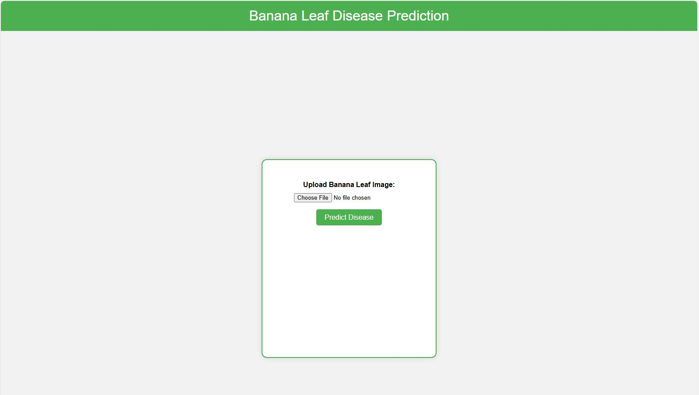
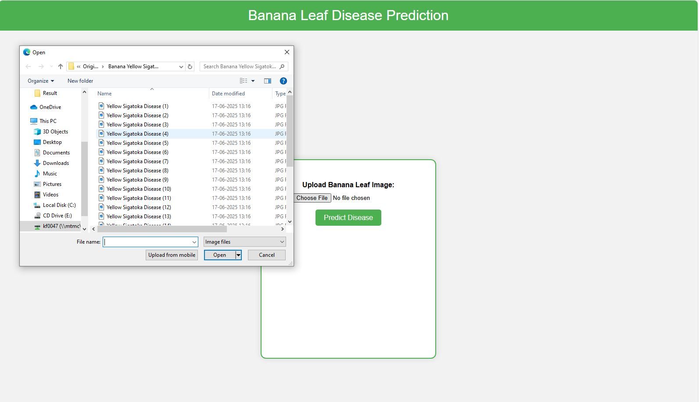
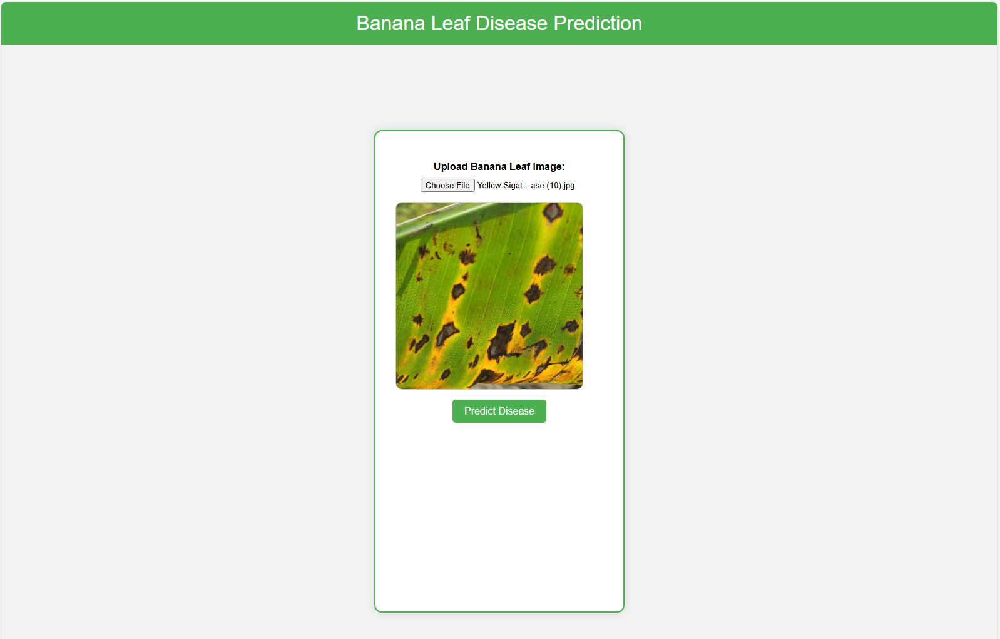
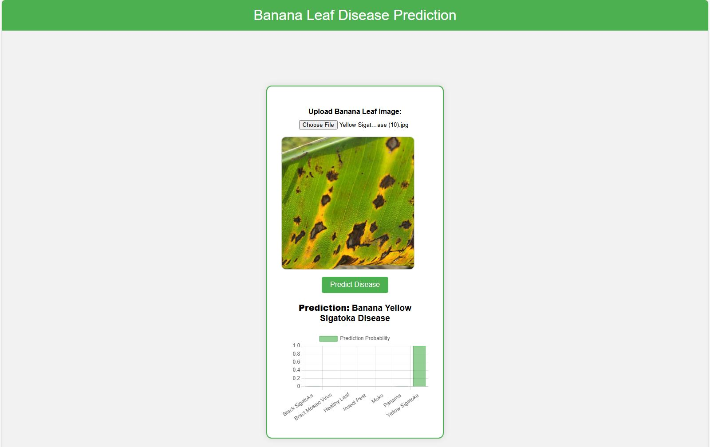

## Banana-Leaf-Disease-Detection

This project implements a **Convolutional Neural Network (CNN)** 
using TensorFlow/Keras to classify **banana leaves** into 
various **disease categories**, including healthy leaves. The 
model is trained on a dataset of labeled banana leaf images 
and performs multi-class image classification.

---
## 🛠️ Tech Stack

- Python
- Flask
- TensorFlow / Keras
- MNIST Dataset
- HTML/CSS

---
# 1. DATASET Collection 

The dataset used in this project was downloaded from Kaggle:

https://www.kaggle.com/datasets/sujaykapadnis/banana-disease-recognition-dataset

This dataset contains categorized images of banana leaves, each labeled with a specific disease class or as healthy. The classes include:

- Black Sigatoka
- Bract Mosaic Virus
- Healthy
- Insect Pest
- Moko
- Panama
- Yellow Sigatoka
---
# 2. MODEL OVERVIEW
**MODEL ARCHITECTURE**

The Convolutional Neural Network (CNN) used in **Banana-Leaf-Disease-Detection**
is designed to automatically extract features from banana 
leaf images and classify them into one of the disease classes.

**The model has the following architecture:**

Layer Name         | Type               | Output Shape       | Parameters
------------------ | ------------------ | ------------------ | ----------
Input              | Input Layer        | (128, 128, 3)      | 0
Conv2D_1           | Conv2D (3×3, 32)   | (126, 126, 32)     | 896
MaxPooling2D_1     | MaxPooling2D (2×2) | (63, 63, 32)       | 0
Dropout_1          | Dropout (25%)      | (63, 63, 32)       | 0
Conv2D_2           | Conv2D (3×3, 64)   | (61, 61, 64)       | 18,496
MaxPooling2D_2     | MaxPooling2D (2×2) | (30, 30, 64)       | 0
Dropout_2          | Dropout (25%)      | (30, 30, 64)       | 0
Conv2D_3           | Conv2D (3×3, 128)  | (28, 28, 128)      | 73,856
MaxPooling2D_3     | MaxPooling2D (2×2) | (14, 14, 128)      | 0
Dropout_3          | Dropout (25%)      | (14, 14, 128)      | 0
Flatten            | Flatten            | (25088,)           | 0
Dense_1            | Dense (256 units)  | (256,)             | 6,422,784
Dropout_4          | Dropout (50%)      | (256,)             | 0
Output             | Dense (Softmax)    | (7,)               | 7


The CNN architecture includes:
- 3 convolutional layers with ReLU activation and max pooling
- Dropout layers to reduce overfitting
- A fully connected dense layer
- A softmax output layer for classification

The model is compiled with:
- Optimizer: Adam
- Loss: Categorical Crossentropy
- Metric: Accuracy

The model is trained for 100 epochs.

---
# 3. TRAINING & SAVING

- Training and validation images are augmented for robustness.
- The trained model is saved as:
    model/Banana Disease Recognition_model.h5
- Training history (loss/accuracy) is saved as:
    model/Banana Disease Recognition_history.npy

---
# 4. EVALUATION & VISUALIZATION

- Training vs Validation Loss and Accuracy plots are generated.
- Confusion matrix is visualized using seaborn heatmap.
- Evaluation metrics include:
    - Accuracy
    - Precision (macro avg)
    - Recall (macro avg)
    - F1-score (macro avg)
    - AUC-ROC score (multi-class)
-----
# Model Results
Below are the visual results of the trained CNN model:

# 1. Accuracy Curve (Training vs. Testing):
   

# 2. Loss Curve (Training vs. Testing):
   

# 3. Confusion Matrix:
   

--- 
## Screenshots





---
# 5. DEPENDENCIES

- tensorflow
- keras
- numpy
- matplotlib
- seaborn
- sklearn
- PIL (for image loading)
---
### 🧪 How to Run Locally
```
git clone https://github.com/kavitha-35/Banana-Leaf-Disease-Detection.git
cd Digit-Recognition
python -m venv venv
source venv/bin/activate  # On Windows: venv\Scripts\activate
pip install -r requirements.txt
python app.py
```

