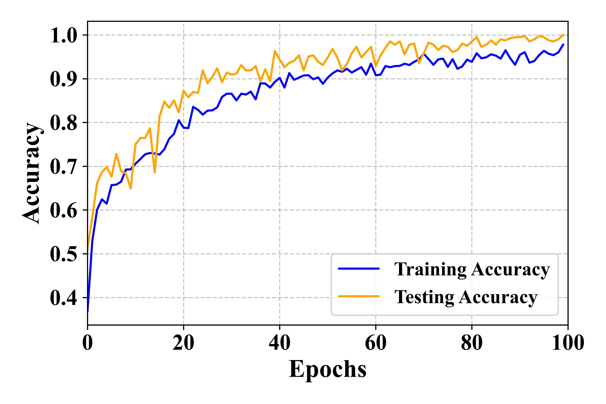
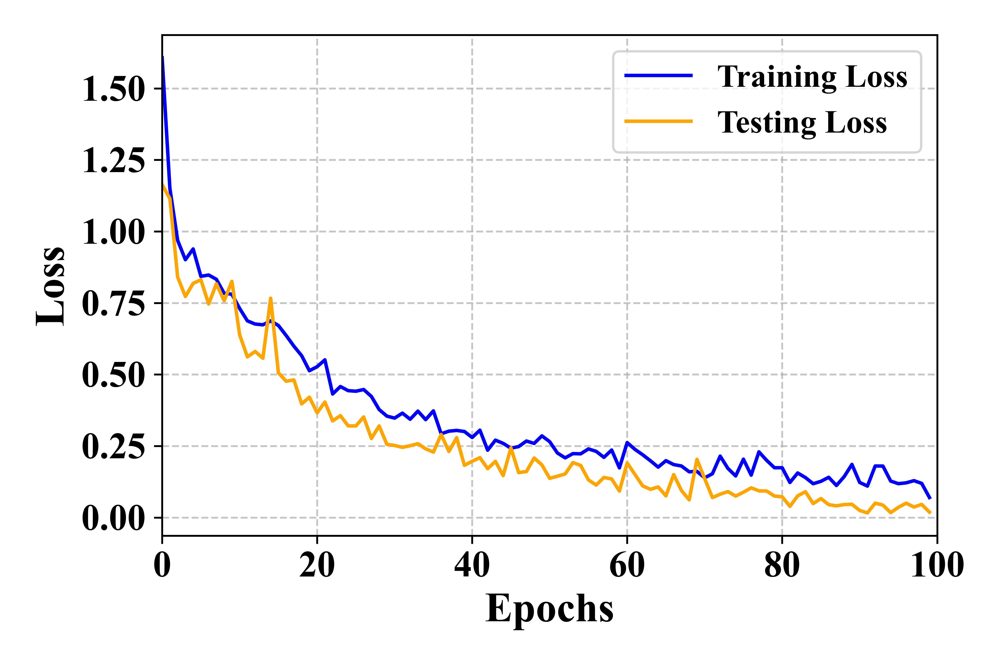
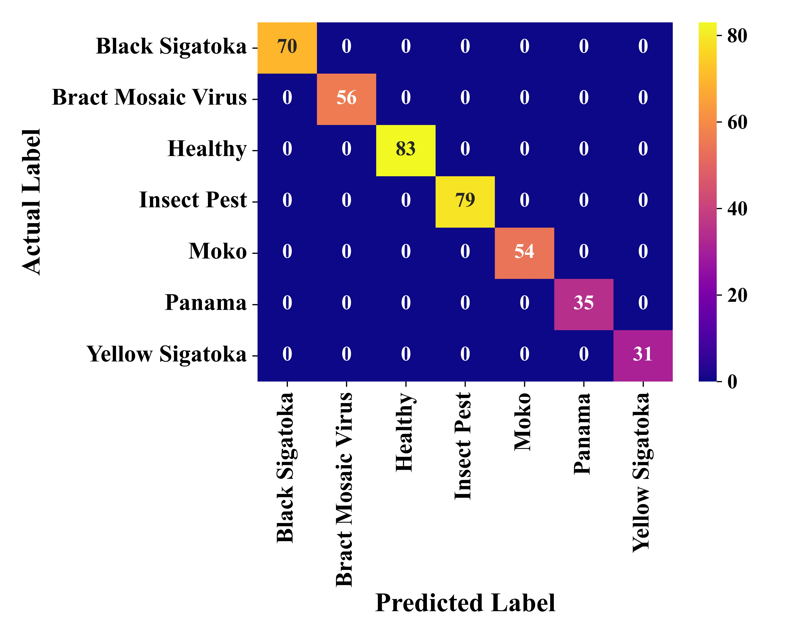

# Banana-Leaf-Disease-Detection
This project implements a Convolutional Neural Network (CNN) 
using TensorFlow/Keras to classify banana leaves into 
various disease categories, including healthy leaves. The 
model is trained on a dataset of labeled banana leaf images 
and performs multi-class image classification.
---
## 🛠️ Tech Stack

- Python
- Flask
- TensorFlow / Keras
- MNIST Dataset
- HTML/CSS

---
# 1. DATASET Collection 

The dataset used in this project was downloaded from Kaggle:

https://www.kaggle.com/datasets/sujaykapadnis/banana-disease-recognition-dataset

This dataset contains categorized images of banana leaves, each labeled with a specific disease class or as healthy. The classes include:

- Black Sigatoka
- Bract Mosaic Virus
- Healthy
- Insect Pest
- Moko
- Panama
- Yellow Sigatoka
---
# 2. MODEL OVERVIEW

The CNN architecture includes:
- 3 convolutional layers with ReLU activation and max pooling
- Dropout layers to reduce overfitting
- A fully connected dense layer
- A softmax output layer for classification

The model is compiled with:
- Optimizer: Adam
- Loss: Categorical Crossentropy
- Metric: Accuracy

The model is trained for 100 epochs.

---
# 3. TRAINING & SAVING

- Training and validation images are augmented for robustness.
- The trained model is saved as:
    model/Banana Disease Recognition_model.h5
- Training history (loss/accuracy) is saved as:
    model/Banana Disease Recognition_history.npy

---
# 4. EVALUATION & VISUALIZATION

- Training vs Validation Loss and Accuracy plots are generated.
- Confusion matrix is visualized using seaborn heatmap.
- Evaluation metrics include:
    - Accuracy
    - Precision (macro avg)
    - Recall (macro avg)
    - F1-score (macro avg)
    - AUC-ROC score (multi-class)
-----
# Model Results

--- 
# 5. DEPENDENCIES

- tensorflow
- keras
- numpy
- matplotlib
- seaborn
- sklearn
- PIL (for image loading)

Install dependencies with:
pip install -r requirements.txt
---

